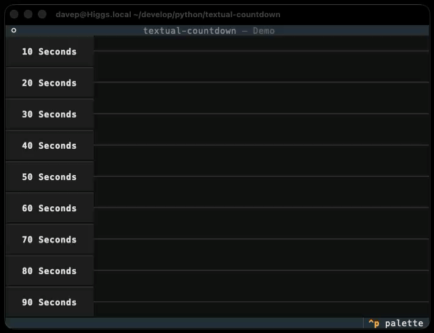

# textual-countdown



## Introduction

This library provides a simple visual countdown widget, designed to subtly
let the user know that a period of time is passing; essentially a simple
"wait some time" progress bar.

Uses could be as a non-intrusive countdown in some sort of quiz application,
or a cool-down display in an application that's waiting to hit a busy API
endpoint again.

## Installing

The package can be installed with `pip` or related tools, for example:

```sh
$ pip install textual-countdown
```

## Demo

Once installed, you can try a demo of the library with:

```sh
$ python -m textual_countdown
```

## Using the widget

To import the widget, do:

```python
from textual_countdown import Countdown
```

The `Countdown` widget can then be composed into your application like any
other Textual widget.

### Controlling the countdown

The widget provides the following methods:

- `start(countdown: float) -> None` -- call this to start a countdown,
  giving the number of seconds to count down.
- `cancel() -> None` -- to cancel a countdown.

There is also a `is_running` property to check if the countdown is running.

### Events

The following events will be sent from the widget:

- `Countdown.Started` -- posted when a countdown starts.
- `Countdown.Finished` -- posted when a countdown finishes.
- `Countdown.Cancelled` -- posted if a countdown is cancelled.

All events have a `countdown` property that points to the widget that sent
them; `Started` and `Finished` also have a `counting` property that gives
the amount of time being counted.

### Styling

The non-counting colour for the countdown display is controlled by the
standard Textual `colour` CSS style. The active time-remaining portion of
the display is controlled by a `countdown--remaining` component class.

As an example, if you wanted to colour the non-running/expired portion of a
countdown as red, and the time remaining as green, you could do:

```scss
Countdown {
    color: red;

    &> .countdown--remaining {
        color: green;
    }
}
```

Additionally, when a `Countdown` is running, it will have a
`countdown--running` class applied; this allows styling of non-running and
running countdown widgets.

[//]: # (README.md ends here)
