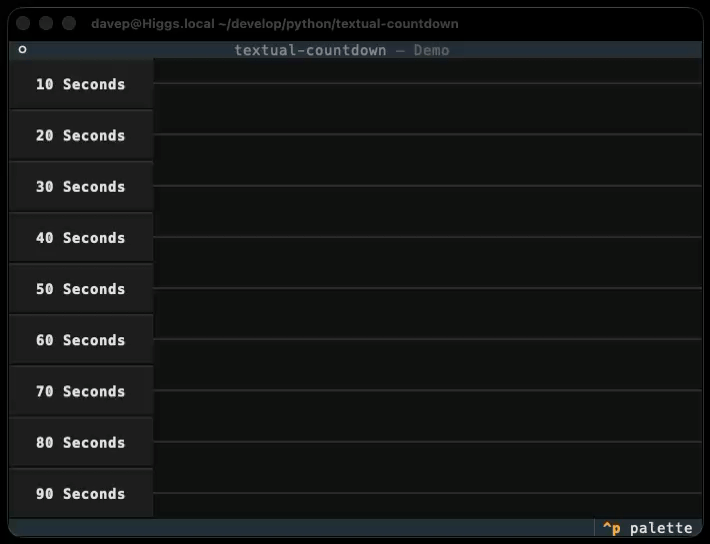

# Introduction

<figure markdown="span">
    
    <figcaption>Demo application for `textual-countdown`</figcaption>
</figure>

This library provides a simple visual countdown widget
[Textual](https://textual.textualize.io) applications, designed to subtly
let the user know that a period of time is passing; essentially a simple
"wait some time" progress bar.

Example uses for the widget could be as a non-intrusive countdown in some
sort of quiz application, or a cool-down display in an application that's
waiting to hit a busy API endpoint again.

# Installing

`textual-countdown` is [available from
pypi](https://pypi.org/project/textual-countdown/) and can be installed with
`pip` or similar Python package tools:

```shell
$ pip install textual-countdown
```

# Demo

Once installed, you can try a demo of the library with:

```sh
$ python -m textual_countdown
```

# Requirements

The only requirement for this library, other than the standard Python
library, is [`textual`](https://textual.textualize.io).

[//]: # (index.md ends here)
